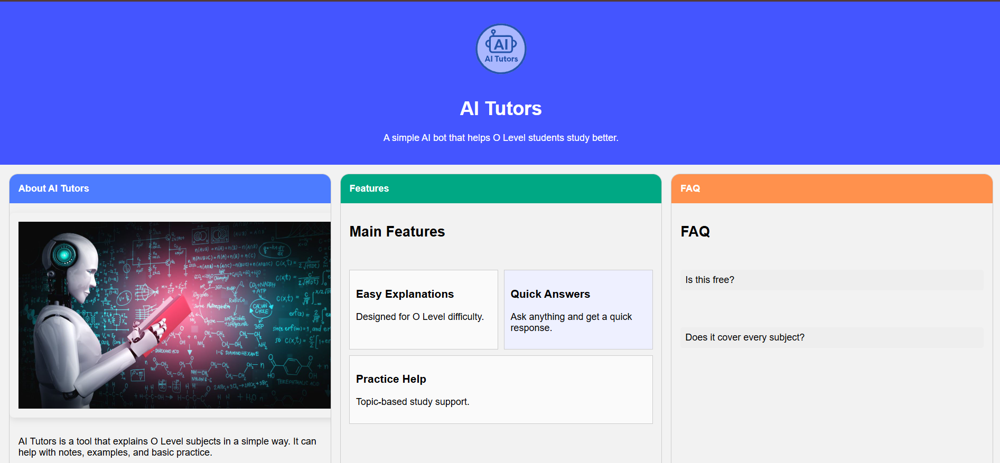
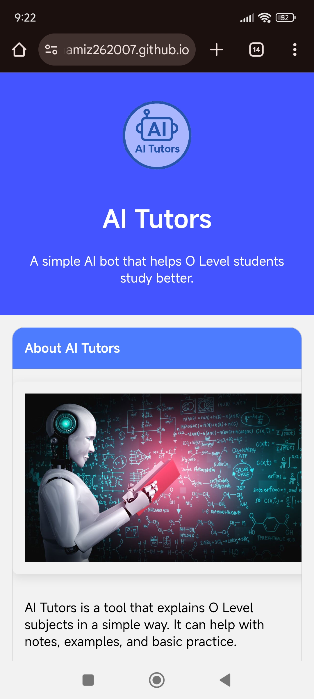
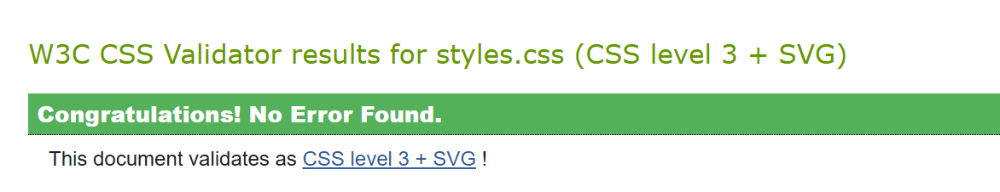

## AI Tutor Website for O-Level Students

## Project Overview
This project is a responsive single-page website designed for an AI Tutor platform aimed at helping O-Level students. The goal is to provide an intuitive, accessible, and visually appealing interface for students to interact with AI-based learning resources.

## Features
- Responsive layout using CSS Grid and Flexbox
- Three CSS-only interactive components (hover effects, accordion, and animated buttons)
- Fully functional HTML form with:
  - Text inputs (Name, Email)
  - Checkboxes (Subjects of interest)
  - Radio buttons (Preferred learning style)
  - Dropdown select (Study plan)
  - Textarea (Feedback)
  - Submit button
- Accessibility compliance (labels, ARIA attributes, keyboard navigation)

## Tech Stack
- HTML5 for semantic structure
- CSS3 for styling and responsiveness

## Design Rationale
The design uses a clean, academic theme with soft blue, green, orange, and purple tones to distinguish each section.Clear typography to ensure readability. CSS Grid is used for the global layout, while Flexbox handles component alignment. The form is styled for clarity and ease of use.

## Responsive Design
Breakpoints:
- **Mobile:** up to 600px
- **Tablet:** 601px - 1024px
- **Desktop:** above 1024px

## Form Details
The form simulates a real-world scenario for an AI tutoring service, allowing students to register their interests and provide feedback.

## Accessibility
- Proper use of `<label>` tags
- Keyboard focus states
- ARIA attributes for better screen reader support

## Screenshots
## 🖥️ Desktop View

## 📱 Mobile View

## Validator Proofs
### HTML Validation

### CSS Validation

##  Deployment Instructions
1. Push all files to GitHub repository.
2. Enable **GitHub Pages** in repository settings.
3. Share the live link.

---
**Author:** [Muhammad Hamiz Anwar]  
**Date:** November 2025
